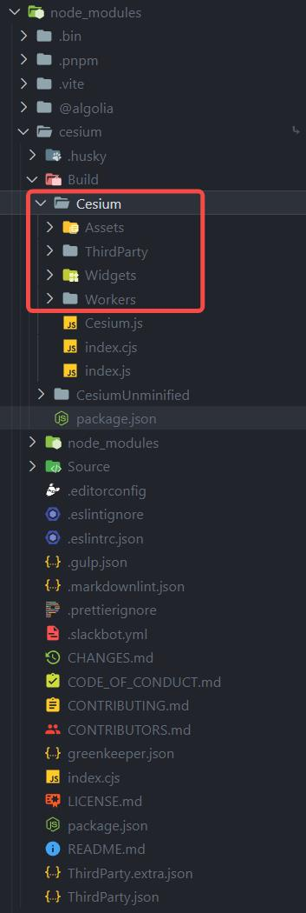
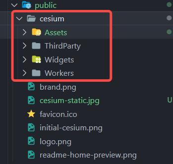

# xj-web3d

## 1-概述
A Web3D help library. Can help you quick development project.

## 2-使用

```js
npm i xj-web3d
```

### 2.1-使用cesium相关

#### 2.1.1-前置环境

1. 下载cesium包：
    ```js
    npm i cesium
    ```
2. 将cesium需要的静态资源放到项目的public目录
    
    

    
3. 设置cesium静态资源的window.CESIUM_BASE_URL为cesium静态资源url路径，例如：```window.CESIUM_BASE_URL='/cesium/'```，如果
项目有baseUrl，那么应该这么设置```window.CESIUM_BASE_URL='/baseUrl值/cesium/'```

4. 