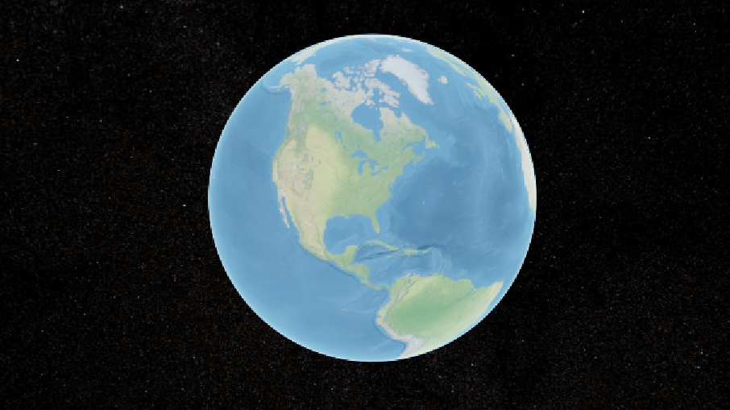

# xj-web3d

## 1-概述

一个web3d帮助库，能够帮助你减少开发的代码量。集成了常见的web3d库，例如：three、cesiumGS、mapboxGL

## 2-使用

```js
npm i xj-web3d
```

### 2.1-使用cesium相关

#### 2.1.1-初始化cesium场景

1. 下载cesium包：
    ```js
    npm i cesium
    ```
2. 将cesium需要的静态资源放到项目的public目录
    
    

    
3. 设置cesium静态资源的window.CESIUM_BASE_URL为cesium静态资源url路径，例如：```window.CESIUM_BASE_URL='/cesium/'```，如果
项目有baseUrl，那么应该这么设置```window.CESIUM_BASE_URL='/baseUrl值/cesium/'```

4. 在项目的main.ts中引入cesium的widgets.css：
    ```js
    import "cesium/Build/Cesium/Widgets/widgets.css";
    ```
5. 配置你cesium的token：
    ```js
    import { Ion } from "cesium"
    Ion.defaultAccessToken = 'your accesstoken';
    ```
6. 总体配置为：
    
    

7. 现在cesium的预制环境已经配好了，我们可以开始使用xj-web3d来帮助你快速创建cesium场景啦
8. 引入xj-web3d：
    ```js
    import { XJ } from "xj-web3d";
    ```
9.  初始化cesium场景：
    ```js
    XJ.initCesiumScene(container用于存放cesium场景的dom元素（可以是一个div）)
    ```


